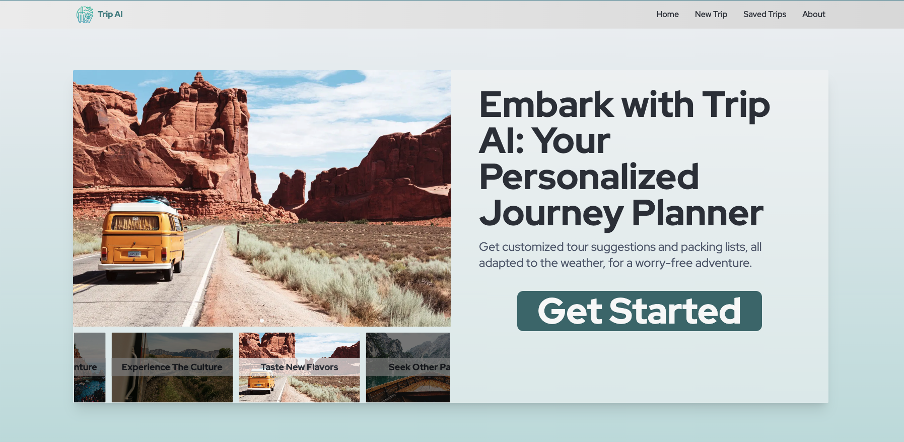

# Trip-Ai

https://trip-ai-weld.vercel.app/

Trip AI makes travel planning fun by creating customized itineraries that match your preferences.
Whether you're looking to explore vibrant cities or quiet natural retreats, Trip AI make travel plans simple and personal. It offers detailed tours suggestions, a list of things to pack, all adapted to the weather.

## Features

- **AI Powered Travel Guide** - Trip AI uses OpenAI's GPT-4 to generate personalized travel itineraries based on your preferences.
- **Customized Itineraries** - It creates customized itineraries based on your preferences, including the number of days you plan to travel, your budget, and your interests.
- **Weather Adapted Packing List** - Trip AI generates a packing list based on the weather forecast for your destination, so you'll always be prepared for your trip. Also provides a current and 5-day weather forecast for your destination.
- **Save Itineraries** - Trip AI allows you to save your trip itineraries so you can access them later. It includes a search feature to help finding saved trips quickly.

## Tech Stack

- **Next.js** - Next.js was chosen to allow to build a full-stack application with React.
- **TypeScript** - to improve code quality by adding static types.
- **React Query** - to manage server state, in the database and API requests, and to cache data.
- **Context API** - to make state available throughout the application without prop drilling.
- **Tailwind CSS** - to style the application quickly and responsively.
- **Next UI** - to create a consistent design system and reusable components.
- **Axios** - to make API requests with ease.
- **Zod** - to validate data and ensure data integrity.
- **Prisma** - to interact with the database.
- **Postgres** - as database choice.
- **OpenAI API** - to generate personalized travel itineraries.
- **GSAP Animation and Framer Motion** - to create scroll animations and transitions.
